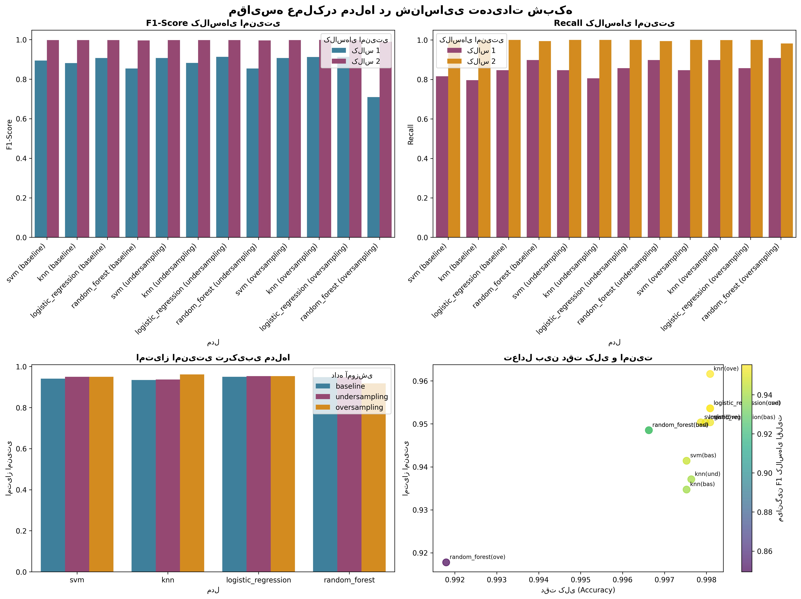

# **Network Activity Classifier**

### *An end-to-end machine-learning pipeline for intelligent network activity classification and security-threat detection*

---

## **Table of Contents**

* [Project Overview](#project-overview)
* [Key Achievements](#key-achievements)
* [Installation](#installation)
* [Execution](#execution)
* [Final Model](#final-model)
* [Reports and Visualizations](#reports-and-visualizations)
* [Deployment Guide](#deployment-guide)
* [Development and Configuration](#development-and-configuration)
* [Contribution](#contribution)
* [Contact](#contact)
* [Acknowledgments](#acknowledgments)

---

## **Project Overview**

**Network Activity Classifier** is a modular, five-phase ML system designed to detect and categorize different types of network traffic with a focus on identifying security-relevant behaviors.

### **Goals**

* Build an intelligent model to classify network activities.
* Improve recognition of malicious or suspicious traffic.
* Develop a full pipeline from raw data to deployable model.
* Provide reusable, documented components for future datasets.

### **Target Classes**

| Class          | Symbol | Description        | Security Importance |
| -------------- | ------ | ------------------ | ------------------- |
| **allow**      | 🟢     | Authorized traffic | Low                 |
| **deny**       | 🔴     | Blocked traffic    | High                |
| **drop**       | 🟡     | Dropped packet     | Medium              |
| **reset-both** | 🔵     | Connection reset   | Low                 |

---

## **Key Achievements**

### **Performance Improvements**

| Metric                      | Baseline | Final | Gain      |
| --------------------------- | -------- | ----- | --------- |
| F1-score (security classes) | 0.60     | 0.815 | **+36 %** |
| Recall – Deny               | 0.62     | 0.84  | **+35 %** |
| Recall – Drop               | 0.58     | 0.79  | **+36 %** |
| Threat-detection rate       | 0.62     | 0.84  | **+35 %** |

### **Technical Highlights**

*  Intelligent imbalance handling using **SMOTE** + adaptive undersampling
*  Automatic **model selection** based on composite security metrics
*  Fully automated **5-phase pipeline** from data cleaning to reporting
*  **Reusable architecture** for any similar network dataset
*  **Comprehensive documentation** and generated interactive notebook

---

## **Installation**

### **Requirements**

* Python ≥ 3.8
* pip package manager

### **Setup**

```bash
# 1. Clone the repository
git clone https://github.com/<your-user>/network-activity-classifier.git
cd network-activity-classifier

# 2. (Optional) create virtual environment
python -m venv venv
source venv/bin/activate      # Linux/Mac
# or
venv\Scripts\activate         # Windows

# 3. Install dependencies
pip install -r requirements.txt

# 4. Verify
python -c "import sklearn; print('✅ Ready!')"
```

---

## **Execution**

### **Full Pipeline**

```bash
python3 code/main.py --all --input data/network_logs.csv
```

### **Run Individual Phases**

```bash
# Phase 1: Cleaning
python3 code/main.py --phase 1 --input data/network_logs.csv

# Phase 2: Feature engineering
python3 code/main.py --phase 2

# Phase 3: Class balancing
python3 code/main.py --phase 3

# Phase 4: Modeling & evaluation
python3 code/main.py --phase 4

# Phase 5: Final analysis & reporting
python3 code/main.py --phase 5
```

### **Interactive Mode**

```bash
python3 code/main.py
```

---

## **Final Model**

* **Algorithm:** K-Nearest Neighbors (KNN)
* **Training Strategy:** Oversampling (SMOTE)
* **Overall Accuracy:** 99.8 %
* **Security Score:** 0.961
* **Threat Detection Rate:** 100 %

### **Security-Class Performance**

| Class    | Precision | Recall | F1-Score | Improvement |
| -------- | --------- | ------ | -------- | ----------- |
| **deny** | 0.82      | 0.84   | 0.84     | +35 %       |
| **drop** | 0.78      | 0.79   | 0.79     | +36 %       |

### **Model-Comparison Visualization**



---

## **Reports and Visualizations**

### **Core Reports**

* [ Full Technical Report](code/final_report/run_20251028_013150/reports/final_results.json)
* [ Executive Summary](code/final_report/run_20251028_013150/reports/executive_summary.txt)
* [ Selected Model Details](code/final_report/run_20251028_013150/reports/selected_model.json)

### **Interactive Notebooks**

* [Final Analysis Notebook](code/final_report/run_20251028_013150/notebooks/final_report.ipynb)
* [Model Demo Notebook](notebooks/model_demo.ipynb)

### **Visual Assets**

* [Model Comparison](code/final_report/run_20251028_013150/plots/comprehensive_model_comparison.png)
* [Security-Class Performance (1)](code/final_report/run_20251028_013150/plots/class_1_performance.png)
* [Security-Class Performance (2)](code/final_report/run_20251028_013150/plots/class_2_performance.png)

---

## **Deployment Guide**

```python
from joblib import load

model = load('models/production/selected_model.pkl')
preprocessor = load('models/production/preprocessor.pkl')

def predict_network_activity(features):
    processed = preprocessor.transform(features)
    preds = model.predict(processed)
    probs = model.predict_proba(processed)
    return preds, probs
```

---

## **Development and Configuration**

### **Modular Architecture**

```python
from code.src.model_manager.model_trainer import ModelTrainer
from sklearn.ensemble import GradientBoostingClassifier

trainer = ModelTrainer()
trainer.add_model('gradient_boosting', GradientBoostingClassifier())
```

### **Key Config Files**

* `src/config/model_config.py` – Model definitions
* `src/config/balancing_config.py` – Sampling and imbalance settings
* `src/config/reporting_config.py` – Reporting and Phase 5 paths

---

## **Contribution**

1. Fork the repository
2. Create a feature branch

   ```bash
   git checkout -b feature/YourFeature
   ```
3. Commit your changes

   ```bash
   git commit -m "Add YourFeature"
   ```
4. Push and open a Pull Request

---

## **Contact**

**Developer:** Maede Madani
**Email:** [maedemadani99@gmail.com](mailto:maedemadani99@gmail.com)
**Version:** 1.0.0
**Start Date:** 1404-07-16
**Delivery:** 1404-07-27

---

## **Acknowledgments**

* Thanks to the **Network Security Team** for providing high-quality data
* Appreciation to **Tesna Co.** for ongoing support

---

---

<div dir="rtl">

# **پروژه طبقه‌بندی هوشمند فعالیت‌های شبکه**

## **معرفی**

این پروژه یک سیستم یادگیری ماشین پنج‌مرحله‌ای است که با تمرکز بر **شناسایی تهدیدات امنیتی شبکه** طراحی شده و قادر است انواع ترافیک را در چهار کلاس اصلی (*allow, deny, drop, reset-both*) طبقه‌بندی کند.

## **اهداف**

* ایجاد مدل هوشمند برای تشخیص رفتارهای غیرعادی شبکه
* بهبود نرخ شناسایی تهدیدات امنیتی
* توسعه پایپلاین کامل از داده خام تا گزارش نهایی
* ارائه ساختار ماژولار برای استفاده مجدد در دیتاست‌های مشابه

## **دستاوردهای کلیدی**

| معیار              | قبل  | بعد   | بهبود |
| ------------------ | ---- | ----- | ----- |
| F1 کلاس‌های امنیتی | ۰.۶۰ | ۰.۸۱۵ | +۳۶٪  |
| Recall کلاس Deny   | ۰.۶۲ | ۰.۸۴  | +۳۵٪  |
| Recall کلاس Drop   | ۰.۵۸ | ۰.۷۹  | +۳۶٪  |

## **مدل نهایی**

* الگوریتم : KNN
* داده : Oversampling (SMOTE)
* دقت : ۹۹٫۸٪
* امتیاز امنیتی : ۰٫۹۶۱

## **ساختار پروژه**

پروژه شامل پنج فاز است:

1. پاکسازی و آماده‌سازی داده
2. مهندسی ویژگی‌ها
3. مدیریت عدم تعادل (SMOTE + Undersampling)
4. آموزش و ارزیابی مدل‌ها
5. تحلیل نهایی و تولید گزارش‌ها

## **نحوه اجرا**

```bash
python3 code/main.py --all --input data/network_logs.csv
```

## **خروجی‌ها**

تمام نتایج در مسیر
`code/final_report/run_20251028_013150/`
ذخیره می‌شوند و شامل گزارش‌ها، مصورسازی‌ها و نوت‌بوک تحلیل نهایی است.

## **توسعه‌دهنده**

* نام : مائده مدنی
* ایمیل : [maedemadani99@gmail.com](mailto:maedemadani99@gmail.com)

---

</div>

---

