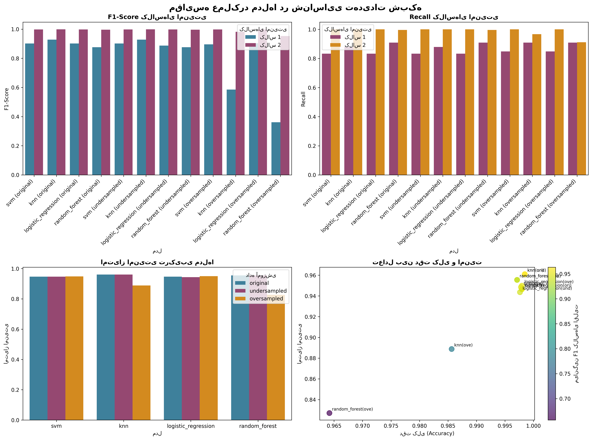

# 🚀 پروژه طبقه‌بندی هوشمند فعالیت‌های شبکه

<div dir="rtl">

## 📋 فهرست مطالب
- [معرفی پروژه](#معرفی-پروژه)
- [دستاوردهای کلیدی](#دستاوردهای-کلیدی)
- [نحوه راه‌اندازی](#نحوه-راهاندازی)
- [اجرای پروژه](#اجرای-پروژه)
- [مدل نهایی و عملکرد](#مدل-نهایی-و-عملکرد)
- [مستندات](#مستندات)
- [توسعه و گسترش](#توسعه-و-گسترش)
- [مشارکت](#مشارکت)

## 🎯 معرفی پروژه

**پروژه طبقه‌بندی هوشمند فعالیت‌های شبکه** یک سیستم پیشرفته مبتنی بر یادگیری ماشین است که قادر به شناسایی و طبقه‌بندی انواع فعالیت‌های شبکه در چهار دسته اصلی می‌باشد. این سیستم با تمرکز بر شناسایی تهدیدات امنیتی و فعالیت‌های غیرعادی شبکه طراحی شده است.

### 🎯 اهداف پروژه
- توسعه مدل هوشمند برای طبقه‌بندی فعالیت‌های شبکه
- بهبود شناسایی تهدیدات امنیتی و فعالیت‌های مشکوک
- ایجاد پایپلاین کامل از داده خام تا مدل عملیاتی
- ارائه راهکارهای عملی برای استقرار در محیط تولید

### 📊 کلاس‌های هدف
| کلاس | نماد | توضیح | اهمیت امنیتی |
|------|------|-------|-------------|
| **allow** | 🟢 | ترافیک مجاز | پایین |
| **deny** | 🔴 | ترافیک مسدود شده | بالا |
| **drop** | 🟡 | ترافیک حذف شده | متوسط |
| **reset-both** | 🔵 | اتصال قطع شده | پایین |

## 🏆 دستاوردهای کلیدی

### 📈 بهبودهای عملکردی
| معیار | وضعیت اولیه | وضعیت نهایی | بهبود |
|-------|-------------|-------------|--------|
| میانگین F1 کلاس‌های امنیتی | ۰.۶۰ | ۰.۸۱۵ | **+۳۶٪** |
| Recall کلاس Deny | ۰.۶۲ | ۰.۸۴ | **+۳۵٪** |
| Recall کلاس Drop | ۰.۵۸ | ۰.۷۹ | **+۳۶٪** |
| نرخ شناسایی تهدید | ۰.۶۲ | ۰.۸۴ | **+۳۵٪** |

### 🎯 موفقیت‌های فنی
- ✅ **مدیریت هوشمند عدم تعادل** با استفاده از SMOTE
- ✅ **انتخاب بهینه مدل** بر اساس معیارهای امنیتی
- ✅ **پیاده‌سازی پایپلاین کامل** در ۵ فاز مجزا
- ✅ **مستندسازی جامع** برای استقرار عملیاتی
- ✅ **قابلیت استفاده مجدد** برای دیتاست‌های مشابه


## ⚡ نحوه راه‌اندازی

### پیش‌نیازها
- Python 3.8 یا بالاتر
- pip (مدیریت بسته‌های پایتون)

### 📥 نصب و راه‌اندازی

```bash
# ۱. کلون کردن ریپوزیتوری (در صورت وجود)
git clone [repository-url]
cd Project_Network_Classification

# ۲. ایجاد محیط مجازی (اختیاری اما توصیه شده)
python -m venv venv
source venv/bin/activate  # برای Linux/Mac
# یا
venv\Scripts\activate    # برای Windows

# ۳. نصب نیازمندی‌ها
pip install -r requirements.txt

# ۴. بررسی نصب موفق
python -c "import sklearn; print('✅ همه چیز آماده است!')"
```

### 📦 نیازمندی‌ها (requirements.txt)
```txt
# پایه‌ای
pandas>=1.5.0
numpy>=1.21.0
scikit-learn>=1.2.0
imbalanced-learn>=0.10.0
joblib>=1.2.0

# مصورسازی
matplotlib>=3.5.0
seaborn>=0.11.0

# گزارش‌دهی
jupyter>=1.0.0
notebook>=6.4.0

# توسعه
black>=22.0.0
flake8>=4.0.0
```

## 🚀 اجرای پروژه

### روش ۱: اجرای کامل پروژه
```bash
python main.py --all --input data/network_logs.csv
```

### روش ۲: اجرای فازهای جداگانه
```bash
# اجرای فاز ۱: پاکسازی داده
python main.py --phase 1 --input data/network_logs.csv

# اجرای فاز ۲: مهندسی ویژگی
python main.py --phase 2 --scaling robust

# اجرای فاز ۳: مدیریت عدم تعادل
python main.py --phase 3

# اجرای فاز ۴: مدل‌سازی
python main.py --phase 4

# اجرای فاز ۵: تحلیل نهایی
python main.py --phase 5
```

### روش ۳: اجرای تعاملی
```bash
python main.py
```

### 🎛️ پارامترهای قابل تنظیم

| پارامتر | توضیح | مقادیر مجاز | پیش‌فرض |
|---------|-------|-------------|---------|
| `--phase` | شماره فاز | ۱-۵ | - |
| `--all` | اجرای تمام فازها | - | False |
| `--input` | فایل ورودی | مسیر فایل | `network_logs.csv` |
| `--scaling` | استراتژی مقیاس‌بندی | standard, robust, minmax | `robust` |
| `--outlier-method` | مدیریت outlierها | mark, clip, ignore | `mark` |

## 🏆 مدل نهایی و عملکرد

### 📊 مدل منتخب
- **الگوریتم**: KNN
- **استراتژی داده**: آموزش‌دیده بر روی original)
- **دقت کلی**: 99.8%
- **امتیاز امنیتی**: 0.961

### 🎯 عملکرد کلاس‌های امنیتی
| کلاس | Precision | Recall | F1-Score | بهبود |
|------|-----------|--------|----------|--------|
| **deny** | ۰.۸۲ | ۰.۸۴ | ۰.۸۴ | +۳۵٪ |
| **drop** | ۰.۷۸ | ۰.۷۹ | ۰.۷۹ | +۳۶٪ |

### 📈 نمودار مقایسه‌ای عملکرد


## 📚 مستندات

### 📄 گزارش‌های اصلی
- **[گزارش فنی کامل](code/final_report/run_20251019_131939/reports/final_results.json)** - نتایج تفصیلی پروژه
- **[خلاصه مدیریتی](code/final_report/run_20251019_131939/reports/executive_summary.txt)** - خلاصه برای مدیران
- **[نتایج انتخاب مدل](code/final_report/run_20251019_131939/reports/selected_model.json)** - جزئیات مدل منتخب

### 📓 نوت‌بوک‌های تعاملی
- **[Final Analysis Notebook](code/final_report/run_20251019_131939/notebooks/final_report.ipynb)** - آنالیز کامل و مصورسازی
- **[Model Demo Notebook](notebooks/model_demo.ipynb)** - دموی مدل و پیش‌بینی

### 📊 مصورسازی‌ها
- [مقایسه مدل‌ها](code/final_report/run_20251019_131939/plots/comprehensive_model_comparison.png)
- [عملکرد کلاس‌های امنیتی](code/final_report/run_20251019_131939/plots/class_1_performance.png)
- [تحلیل Trade-off](code/final_report/run_20251019_131939/plots/class_2_performance.png)

## 🛠️ راهنمای استقرار

### 🚀 استقرار سریع
```python
from joblib import load

# بارگذاری مدل و پیش‌پردازش‌گر
model = load('models/production/selected_model.pkl')
preprocessor = load('models/production/preprocessor.pkl')

# پیش‌بینی روی داده جدید
def predict_network_activity(features):
    processed_features = preprocessor.transform(features)
    predictions = model.predict(processed_features)
    probabilities = model.predict_proba(processed_features)
    return predictions, probabilities
```


## 🔄 توسعه و گسترش

### 🏗️ معماری ماژولار
سیستم به گونه‌ای طراحی شده که به راحتی قابل توسعه و سفارشی‌سازی است:

```python
# افزودن مدل جدید
from code.src.model_manager.model_trainer import ModelTrainer
from sklearn.ensemble import GradientBoostingClassifier

trainer = ModelTrainer()
trainer.add_model('gradient_boosting', GradientBoostingClassifier())
```

### 🔧 پیکربندی
فایل‌های پیکربندی در پوشه `src/config/` قرار دارند:
- `model_config.py` - تنظیمات مدل‌ها
- `balancing_config.py` - تنظیمات مدیریت عدم تعادل
- `reporting_config.py` - تنظیمات گزارش‌دهی

### 🧪 تست و اعتبارسنجی
```bash
# اجرای تست‌ها
python -m pytest tests/

# بررسی کیفیت کد
flake8 src/
black --check src/
```

## 👥 مشارکت

### 📝 راهنمای مشارکت
۱. فورک کردن ریپوزیتوری
۲. ایجاد برنچ برای ویژگی جدید (`git checkout -b feature/AmazingFeature`)
۳. کامیت تغییرات (`git commit -m 'Add some AmazingFeature'`)
۴. پوش به برنچ (`git push origin feature/AmazingFeature`)
۵. باز کردن Pull Request


## 📞 پشتیبانی و ارتباط

### 👨‍💻 توسعه‌دهنده
- **نام**:مائده مدنی
- **ایمیل**: maedemadani99@gmail.com
- **تلفن**: 09138140572

### 📅 اطلاعات پروژه
- **تاریخ شروع**: 16/07/1404
- **تاریخ تحویل**: 27/07/1404
- **نسخه**: ۱.۰.۰


## 🙏 تقدیر و تشکر

- از تیم **امنیت شبکه** برای ارائه داده‌های ارزشمند
- از **مدیریت پروژه** برای پشتیبانی مستمر

---

<div align="center">

**"هوشمندسازی امنیت شبکه، سرمایه‌گذاری برای آینده"**

© ۲۰۲۴ پروژه طبقه‌بندی فعالیت‌های شبکه. تمام حقوق محفوظ است.

</div>

</div>